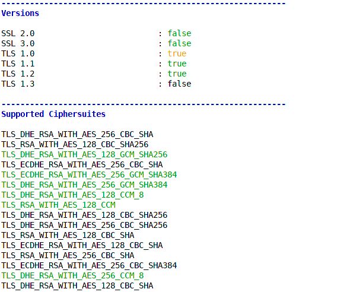
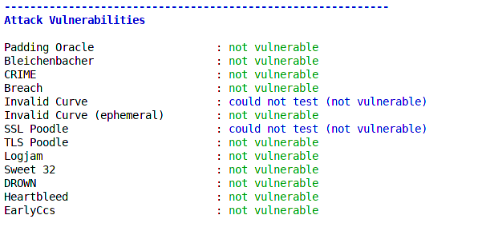
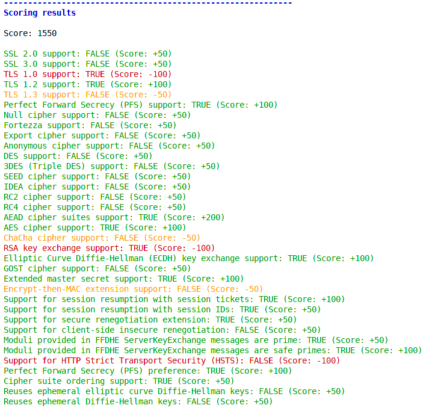
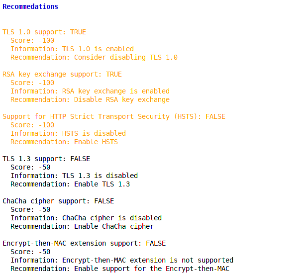

# TLS-Attacker-BurpExtension

The extension is based on the [TLS-Attacker](https://github.com/RUB-NDS/TLS-Attacker) and developed by the [Chair for Network and Data Security from the Ruhr-University Bochum](http://nds.rub.de/) to assist pentesters and security researchers in the evaluation of TLS Server configurations with [Burp Suite](https://portswigger.net/burp).

## Build
To compile the extension from source, you need to have Java and Maven installed, as well as [TLS-Attacker](https://github.com/RUB-NDS/TLS-Attacker) in Version 3.3.1 and [TLS-Scanner](https://github.com/RUB-NDS/TLS-Scanner) in Version 3.0.2.
```bash
$ mvn clean package
```
The extension has been tested with Java 1.8.

## Installation
- Build the JAR file as described above, or download it from [releases](https://github.com/RUB-NDS/TLS-Attacker-BurpExtension/releases).
- Load the JAR file from the target folder into Burp's Extender.

## Usage
Use the URL and port of the tested server and start the scan.
The scan can last up to one minute, depending on the availability of the server. 
After the scan has been finished, you will find the following scanning output, for example:

**Supported versions and cipher suites:**



**Analyzed attacks and vulnerabilities:**



**Resulting score based on the analyzed properties:**



**Recommendations to improve your implementation configuration:**


